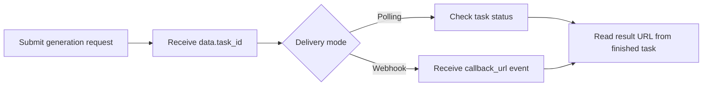

# Happy Horse API with APIDot

Build with the Happy Horse API using APIDot: cURL, Node.js, polling, webhooks, pricing, and fal.ai comparison in one production-oriented GitHub repo.

[Try on APIDot](https://apidot.ai/models/happy-horse) | [Get API Key](https://apidot.ai/dashboard/api-key) | [API Docs](https://apidot.ai/docs/happy-horse) | [Pricing](https://apidot.ai/pricing) | [Main Examples](https://github.com/APIDotAI/apidot-examples)

## Overview

Happy Horse is Alibaba's AI video model for short-form cinematic video generation and editing. It sits in the Happy Horse video line as a creator-focused model for turning prompts, source images, reference images, and short source clips into polished motion outputs.

Happy Horse is most useful when a brief needs motion control and visual continuity more than a generic animation pass. Detailed prompts can steer subject action, camera movement, lighting, and pacing, while image inputs help preserve product shape, character identity, composition, and style for product teasers, ads, and storyboard previews.

On APIDot, Happy Horse is exposed through one unified async API with four modes, 720p or 1080p output, task_id status polling, optional callback_url, and credits-based billing. The integration keeps request boundaries explicit, so teams can automate text-to-video, image-to-video, reference-to-video, and video-edit jobs without mixing incompatible inputs.

## Capabilities

- Text-to-video scenes from carefully directed prompts: Turn a written brief into a short video while guiding subject action, camera movement, lighting, and pacing for concept clips or storyboards.
- Single-image animation for stable first frames: Animate one source image into motion when a product, character, composition, or brand visual needs to anchor the generated clip.
- Reference-guided scenes with clearly ordered characters: Use 1 to 9 reference images to keep roles and identities clear, then refer to them as `character1`, `character2`, and later entries in the prompt.
- Video-edit workflows with optional visual references: Edit a 3 to 60 second source video with a required prompt and up to 5 optional reference images for background, style, or subject guidance.
- Resolution choices for quality and budget control: Choose 720p for faster iteration or 1080p for sharper delivery, with separate per-second credit rates for generation and video-edit jobs.
- Reliable async delivery for production integrations: Submit a task, store the returned `task_id`, then poll status or use `callback_url` so apps can handle longer video work without blocking users.

## Common use cases

Creative, product, and platform teams can use Happy Horse when they need short video outputs that combine prompt control, source imagery, reference consistency, and edit workflows in one API surface.

- Product launch teaser clips
- Social ad concept videos
- Storyboard and previs motion tests
- E-commerce image-to-video product motion
- Multi-character reference-guided scene tests
- Short source-video style edits

## Pricing on APIDot

Catalog price: Starting at $0.080 / second.
Pricing snapshot: per second | 720p video generation: 16 cr/s ($0.080), 1080p video generation: 32 cr/s ($0.160), 720p video edit: 32 cr/s ($0.160), 1080p video edit: 64 cr/s ($0.320)

This README uses the pricing data currently published in the APIDot model catalog. Check the APIDot model page before high-volume production runs.

### Model-specific pricing

- happy-horse: per second | 720p video generation: 16 cr/s ($0.080), 1080p video generation: 32 cr/s ($0.160), 720p video edit: 32 cr/s ($0.160), 1080p video edit: 64 cr/s ($0.320)

## APIDot vs fal.ai

For tiers with fal.ai comparison data in the APIDot catalog, APIDot shows up to 43% lower listed price. Treat this as a catalog snapshot and verify current pricing before launch.

| Tier | APIDot listed price | fal.ai listed price | Note |
| --- | ---: | ---: | --- |
| 720p video generation | $0.08 | $0.14 | APIDot is 43% lower in this tier |
| 1080p video generation | $0.16 | $0.28 | APIDot is 43% lower in this tier |
| 720p video edit | $0.16 | $0.28 | APIDot is 43% lower in this tier |
| 1080p video edit | $0.32 | $0.56 | APIDot is 43% lower in this tier |

## Quick start

    cp .env.example .env
    # Edit .env and set APIDOT_API_KEY
    cd node
    npm start

The same request shape is available as a copy-paste cURL example in curl/generate.md.

## API workflow



Use polling for local tests and webhook delivery for production queues. Store `data.task_id` before the first status check so retries, callbacks, and result URLs can be reconciled safely.

## Minimal API request

Submit to APIDot's unified async generation endpoint:

    POST https://api.apidot.ai/api/generate/submit
    Authorization: Bearer <APIDOT_API_KEY>
    Content-Type: application/json

Primary payload:

```json
{
  "model": "happy-horse",
  "callback_url": "https://your-domain.com/callback",
  "input": {
    "prompt": "A compact electric city bike gliding through a bright morning street market, smooth tracking shot, realistic reflections, lively background motion",
    "duration": 5,
    "aspect_ratio": "16:9",
    "resolution": "1080p",
    "enable_safety_checker": true
  }
}
```

Submit Alibaba Happy Horse video generation or edit jobs through APIDot's unified async generation endpoint.

Happy Horse uses APIDot's shared async generation workflow. Send `model: "happy-horse"`, optional `callback_url`, and one of the supported input shapes. APIDot keeps the four modes explicit so image-to-video, reference-to-video, and video-edit do not leak incompatible fields into each other.

## Model IDs and request variants

### Text to video

```json
{
  "model": "happy-horse",
  "callback_url": "https://your-domain.com/callback",
  "input": {
    "prompt": "A compact electric city bike gliding through a bright morning street market, smooth tracking shot, realistic reflections, lively background motion",
    "duration": 5,
    "aspect_ratio": "16:9",
    "resolution": "1080p",
    "seed": 12345,
    "enable_safety_checker": true
  }
}
```

### Image to video

```json
{
  "model": "happy-horse",
  "callback_url": "https://your-domain.com/callback",
  "input": {
    "image_urls": [
      "https://your-domain.com/source-image.webp"
    ],
    "prompt": "Animate this product photo with a slow push-in and subtle studio reflections",
    "duration": 5,
    "resolution": "1080p",
    "seed": 12345,
    "enable_safety_checker": true
  }
}
```

### Reference to video

```json
{
  "model": "happy-horse",
  "callback_url": "https://your-domain.com/callback",
  "input": {
    "prompt": "character1 hands a glowing map to character2 in a neon train station, cinematic close-up then wide shot",
    "reference_image_urls": [
      "https://your-domain.com/character-1.webp",
      "https://your-domain.com/character-2.webp"
    ],
    "duration": 6,
    "aspect_ratio": "16:9",
    "resolution": "1080p",
    "seed": 12345,
    "enable_safety_checker": true
  }
}
```

### Video edit

```json
{
  "model": "happy-horse",
  "callback_url": "https://your-domain.com/callback",
  "input": {
    "video_url": "https://your-domain.com/source-video.mp4",
    "prompt": "Replace the background with a clean futuristic showroom while preserving the camera motion and product shape",
    "reference_image_urls": [
      "https://your-domain.com/showroom-reference.webp"
    ],
    "resolution": "1080p",
    "audio_setting": "auto",
    "seed": 12345,
    "enable_safety_checker": true
  }
}
```

## Request parameters

| Field | Type | Required | Description |
| --- | --- | --- | --- |
| model | string | yes | Target model id. Use `happy-horse`. |
| callback_url | string | no | Optional webhook callback URL for terminal task updates. |
| input.prompt | string | yes | Required for text-to-video, reference-to-video, and video-edit. Optional for image-to-video. |
| input.resolution | string | no | Output resolution. Supported values are `720p` and `1080p`. |
| input.duration | integer | no | Non-edit video duration in seconds. Supported values are integers from `3` to `15`. Do not send this for video-edit. |
| input.aspect_ratio | string | no | Supported for text-to-video and reference-to-video only. Values: `16:9`, `9:16`, `1:1`, `4:3`, `3:4`. |
| input.image_urls | string[] | no | Image-to-video source image array. Must contain exactly one URL. Cannot be used with `reference_image_urls` or `video_url`. |
| input.reference_image_urls | string[] | no | Reference-to-video requires 1 to 9 image URLs. With `video_url`, this becomes optional video-edit reference images and is limited to 5 URLs. APIDot converts this field to upstream `image_urls` for reference-to-video. |
| input.video_url | string | no | Required for video-edit. Source video must be 3 to 60 seconds; APIDot bills at most 15 seconds. |
| input.audio_setting | string | no | Only valid for video-edit. Supported values are `auto` and `origin`. |
| input.seed | integer | no | Optional deterministic seed from `0` to `2147483647`. |
| input.enable_safety_checker | boolean | no | Optional upstream safety checker flag supported by all modes. |

## Practical integration notes

- Use detailed prompts that describe subject, motion, camera behavior, scene changes, and style.
- For image-to-video, send exactly one URL in `input.image_urls` and do not send `aspect_ratio`.
- For reference-to-video, send 1 to 9 URLs in `input.reference_image_urls`; prompts may refer to `character1`, `character2`, and later entries in upload order.
- For video-edit, send `input.video_url` and `input.prompt`; optional `reference_image_urls` are limited to 5 and `audio_setting` is only valid in this mode.

## Polling and webhooks

APIDot media generation is asynchronous. Store data.task_id immediately after submit, poll /api/generate/status/{task_id} for local tests, and use callback_url webhooks for production queues where users may leave the page before completion.

Webhook handlers should verify task ownership, persist callback events, return 2xx quickly, and be idempotent because duplicate deliveries can happen.

## Response and errors

- code: HTTP-style status code. Successful submits return `200`.
- data.task_id: Async task identifier returned immediately after submission.
- data.status: Initial task status, typically `not_started`.
- data.created_time: ISO 8601 timestamp for task creation.

Common error classes:

- 400 invalid_request: Missing required mode fields, invalid image counts, unsupported duration, unsupported aspect ratio, invalid audio_setting, or invalid source video duration.
- 401 authentication_error: Missing, expired, or invalid Bearer API key.
- 402 insufficient_credits: The current prepaid balance cannot cover the Happy Horse task.
- 429 rate_limited: Submission rate is temporarily above the current allowed limit.

## Production notes

- Keep APIDot API keys in server-side environment variables.
- Persist task_id, selected model, request payload, user ID, and status together.
- Use a moderate polling interval for tests and webhooks for durable production callbacks.
- Validate source media URLs before submitting requests that depend on source files.
- Avoid logging API keys, private prompts, private media URLs, or callback URLs.
- Retry transient network failures with backoff, but do not retry unchanged invalid payloads.

## FAQ

### What is Happy Horse on APIDot suited for?

Happy Horse is suited for short video generation and editing workflows. Use it for prompt clips, source-image animation, reference-guided character scenes, and short source-video edits in product, ad, storyboard, and creative-tool pipelines.

### How should I choose between text, image, reference, and edit modes?

Choose the mode from the media you already have. Use text-to-video for prompt-only clips, image-to-video for one source image, reference-to-video for 1 to 9 identity or style references, and video-edit when you provide a source `video_url`.

### Does image-to-video support `aspect_ratio` on APIDot?

No. Image-to-video sends exactly one `input.image_urls` entry and can include prompt, duration, resolution, seed, and enable_safety_checker, but APIDot does not send `aspect_ratio` for this mode.

### How should I write prompts for `reference_image_urls`?

Write prompts that refer to uploaded references in order. For character or role control, use names such as `character1`, `character2`, and later entries so the model can map each instruction to the intended image.

### What changes when I include `video_url`?

Including `video_url` selects video-edit. In that mode, `prompt` is required, `reference_image_urls` becomes an optional edit reference list with a 5 image limit, `audio_setting` may be `auto` or `origin`, and duration or aspect_ratio should not be sent.

### Does APIDot expose Happy Horse native audio generation?

No, APIDot does not currently expose native audio generation for text, image, or reference workflows. The only exposed audio-related control is video-edit `audio_setting`, which can be set to `auto` or `origin` for edit jobs.

### What duration, resolution, and pricing limits should I plan around?

Plan around 3 to 15 seconds for text, image, and reference generation, plus 720p or 1080p output. Video-edit validates a 3 to 60 second source video and bills at most 15 seconds, with higher credit rates than non-edit generation.

### How do I retrieve the generated video after submission?

Save the returned `task_id` after submission. Poll `/api/generate/status/{task_id}` for progress, or pass `callback_url` to receive the final task result when your application needs asynchronous delivery.

### Which model id should I send?

Use `happy-horse` in the top-level `model` field.

### How does APIDot choose the Happy Horse mode?

A `video_url` selects video-edit. Without `video_url`, `reference_image_urls` selects reference-to-video, `image_urls` selects image-to-video, and otherwise the request is text-to-video.

### Why is reference_image_urls converted upstream?

APIDot accepts `reference_image_urls` for clarity. The task layer converts it to upstream `image_urls` for Happy Horse reference-to-video.

### Which fields are mutually exclusive?

`image_urls` cannot be used with `reference_image_urls` or `video_url`. When `reference_image_urls` is used with `video_url`, it is interpreted as video-edit references.

### Is APIDot the creator of the underlying model?

No. This is an APIDot integration repository for calling Happy Horse through APIDot. Alibaba is listed as the model provider in the APIDot catalog. Use the APIDot model page for current availability, pricing, and usage terms.

## Related links

- APIDot: https://apidot.ai
- Happy Horse model page: https://apidot.ai/models/happy-horse
- Happy Horse API docs: https://apidot.ai/docs/happy-horse
- APIDot quickstart: https://apidot.ai/docs/quickstart
- APIDot webhooks: https://apidot.ai/docs/webhooks
- Main APIDot examples repo: https://github.com/APIDotAI/apidot-examples

## Related APIDot model API repositories

More video API examples from APIDot:

| Model | Repository |
| --- | --- |
| Seedance 2 | [seedance-2-api](https://github.com/APIDotAI/seedance-2-api) |
| Sora 2 Official | [sora-2-official-api](https://github.com/APIDotAI/sora-2-official-api) |
| Veo 3.1 | [veo-3.1-api](https://github.com/APIDotAI/veo-3.1-api) |


